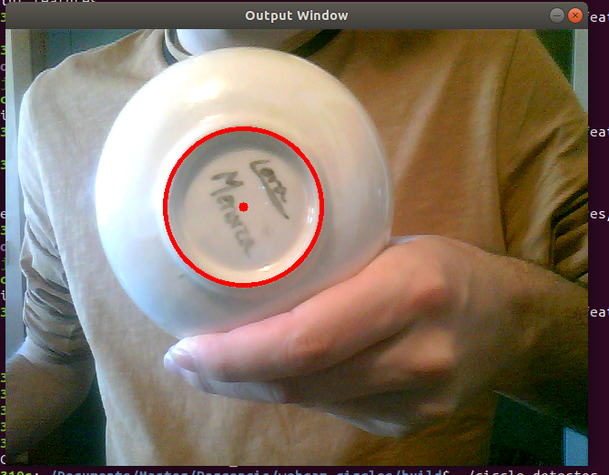

# webcam_circles

Exercise 2.2 of the Perception Systems course. Circle detection from online webcam images.

We have not updated the cpp file of this repository because no major changes were made. Changing the values of different parameters the colors and sizes of the circles and its centers can be changed. It can also be changed the minimud and maximum circle sizes detected which is important to test in order to minimize errors (for each application the results may be different). On the same topic we can also play with the gaussian blur parameter to change the noise filter.

Like in exercise 2.1, to have the program running first we need to do some things. We start by forking the git repository https://github.com/beta-robots/webcam_circles, cloning it to our computer with the command

    $ git clone https://github.com/EloiSoldevilaDalmau/webcam_circles
and building the point_capture example.

To build it we create a directory called "build" inside the webcam_point_features directory

    $ mkdir build
and, being inside the new directory we need to compile and run it. First with

    $ cmake .. 
and then

    $ make 
To execute the example we write

    $ ./circle_detector
when inside the build directory.

Example of what can be seen when running the program with something with a circle shape in front of the camera:

## How the program works: Hough Transforms

This program is able to detect circles using Hough Transforms. The hough transform is a technique that can be used to isolate features of an image of a particular shape (lines, circles or any parametric curve and combination).

The Hough Transform uses the detection of edges as the points it will study (it tries to detect the shape on the edges shown in the image, it tries to find the relation between edge points), having this way all the lines in the image. 

The shapes this transform can detect are the ones that can be descrived with a parametric equation (c + a1*x + b1*y + a2 *x^2 + b2*y^2 +etc =0).

Given a shape we want to detect we know its parametric paramaters (for a line c=x*cos(theta)+y*sin(theta) so the parameters are c and theta, for a circle (x-a)^2+(y-b)^2=r^2 so the parameters are a, b and r). 

What the Hough Transform does is it transforms each edge point (x_i, y_i) to the Hough space. The Hough space is the space of parameters (if for a line we fix x and y the c and theta can be written as the variables and in this case, fixing x and y will define a curve). For a shape with three parameters transforming a point to the Hough space would give a plane and for more parameters it would give higher dimensional shapes.

This program transforms all the edge points to the Hough space and it is easy there to find the shapes because all the points that would be part of the same parametric equation if transformed to the Hough space intersect in a point or higher dimensioal shapes.

Also the program gives information about the size and center of the circle so it can be used in numerous applications.

References:

http://homepages.inf.ed.ac.uk/rbf/HIPR2/hough.htm

https://www.uio.no/studier/emner/matnat/ifi/INF4300/h09/undervisningsmateriale/hough09.pdf

http://people.scs.carleton.ca/~c_shu/Courses/comp4900d/notes/lect10_hough.pdf

https://docs.opencv.org/2.4/doc/tutorials/imgproc/imgtrans/hough_lines/hough_lines.html
